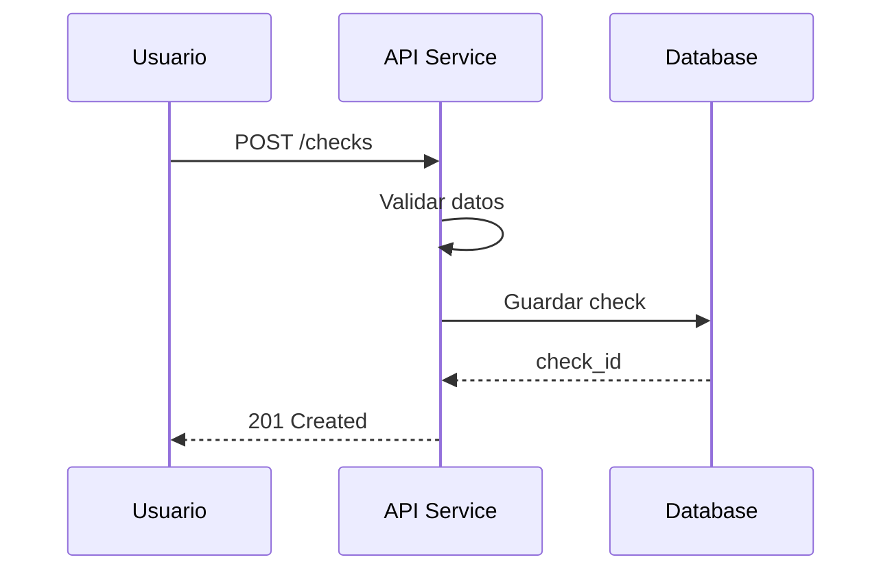
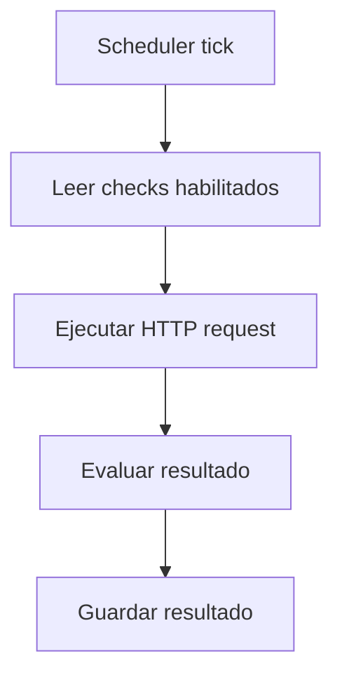

# Flujos del sistema (MVP)

Este documento describe los flujos principales del sistema UptimeGuard durante su ejecución normal.

Los diagramas están escritos usando Mermaid para facilitar su lectura, mantenimiento y versionado.

---

## Flujo 1 — Creación de un check

Este flujo describe qué ocurre cuando un usuario crea un nuevo check mediante la API.


## Flujo 2 - Ejecución periódiuca del worker
Este flujo representa el comportamiento del worker en cada intervalo de ejecución.


## Flujo 3 - Evaluación del estado del servicio
Este flujo detalla cómo se decide si un servicio está UP o DOWN.
```mermaid
flowchart TD
  Request[HTTP request] --> Response{Respuesta válida?}
  Response -- Sí --> Up[Status = UP]
  Response -- No --> Down[Status = DOWN]
  ```

  ## Flujo 4 - Detección de cambio de estado
  Este flujo muestra cómo se detecta un cambio de estado y se decide si enviar una alerta.
  ```mermaid
  flowchart TD
  Current[Estado anterior] --> Compare{Estado cambió?}
  Compare -- No --> Ignore[No hacer nada]
  Compare -- Sí --> Notify[Enviar alerta]
  ```

  ## Flujo 5 - Envío de alerta por webhook
  Este flujo describe el envío de una alerta a un sistema externo mediante webhook.
  ```mermaid
  sequenceDiagram
  participant W as Worker
  participant D as Discord Webhook

  W->>D: POST alerta (JSON)
  D-->>W: 204 No Content
  ```

  ## Flujo 6 - Healthckeck del sistema
  Este flujo representa cómo se comprueba el estado de la API
  ```mermaid
  sequenceDiagram
  participant C as Cliente
  participant A as API Service

  C->>A: GET /health
  A-->>C: 200 OK
  ```
  
